# US — 넷마블 게임아카데미 4기

넷마블문화재단 주관 **넷마블 게임아카데미 4기** 팀 프로젝트 출품작
팀 **화양연화** 제작 · **대상 🏆 수상**

---

## 🎮 게임 소개

**US**는 플랫포머 스토리 어드벤처 게임입니다.

---

## 🏫 넷마블 게임아카데미란?

넷마블문화재단이 주관하는 청소년 대상 게임 개발 교육 프로그램으로,
기획 · 그래픽 · 프로그래밍 각 분야 전문가의 멘토링 아래 약 **8개월간** 실제 게임을 개발하는 과정입니다.

- **운영**: 넷마블문화재단
- **기간**: 2019.05 ~ 2020.01
- **결과물**: 팀별 완성 게임 제작 및 전시·경연

---

## 🛠 기술 스택

- **Engine**: Unity
- **Language**: C#
- **Genre**: 2D Platformer / Story Adventure

---

## 👤 역할

- **기획** — 게임 기획 전담
- **클라이언트 개발** — Unity C# 개발

---

## 🎬 시연 영상

<table>
  <tr>
    <td align="center">
      <a href="https://youtu.be/BboHEp3bOpg"> 영상 1</a>
    </td>
    <td align="center">
      <a href="https://youtu.be/I8omL7ITmXI"> 영상 2</a>
    </td>
  </tr>
  <tr>
    <td align="center">
      <a href="https://youtu.be/YgcTGjLp1o4"> 영상 3</a>
    </td>
    <td align="center">
      <a href="https://youtu.be/NaqcNTMoVtk"> 영상 4</a>
    </td>
  </tr>
</table>

---

## 📸 스크린샷

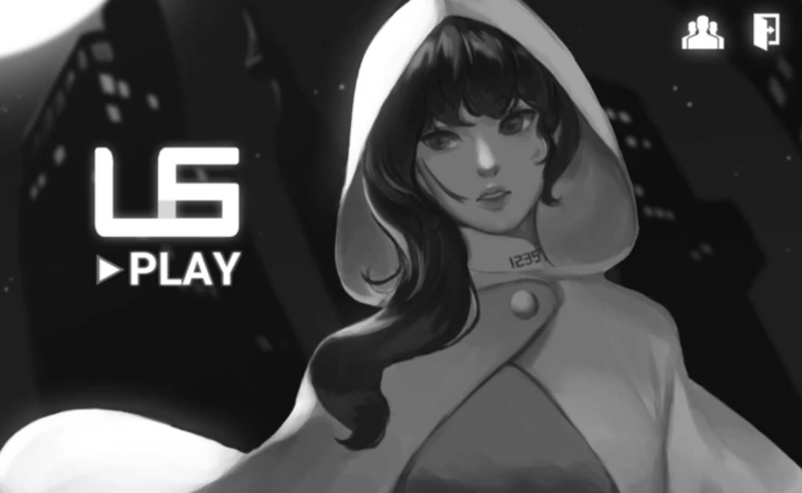

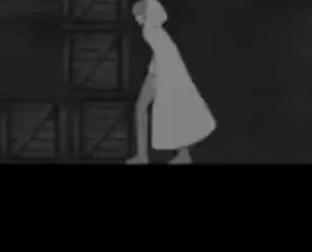 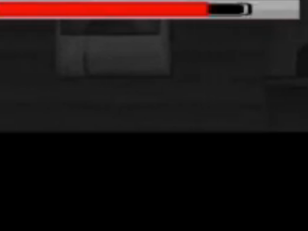 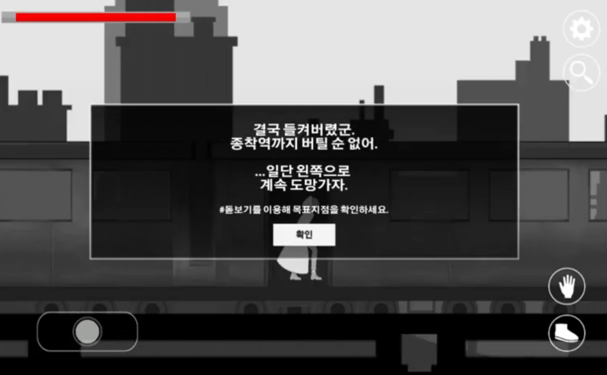
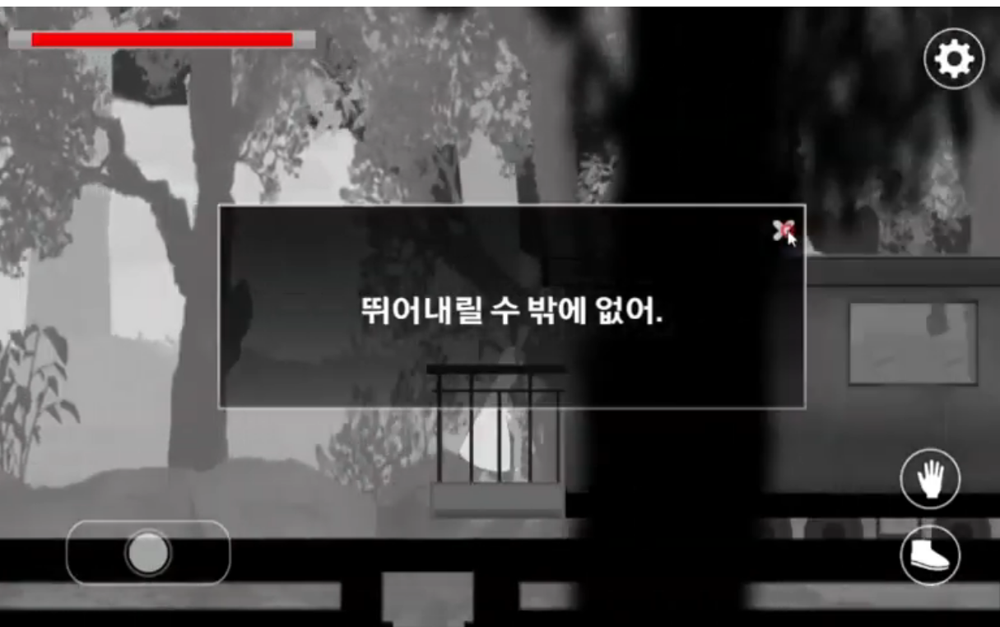 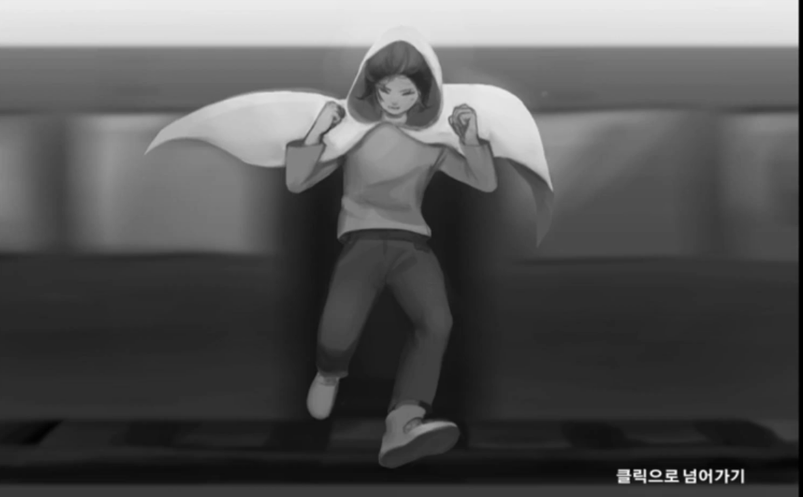 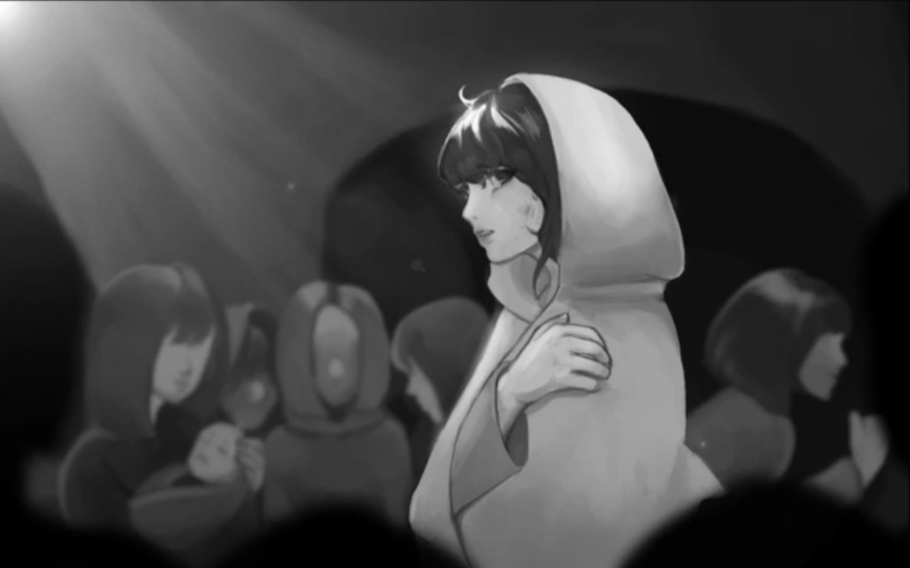
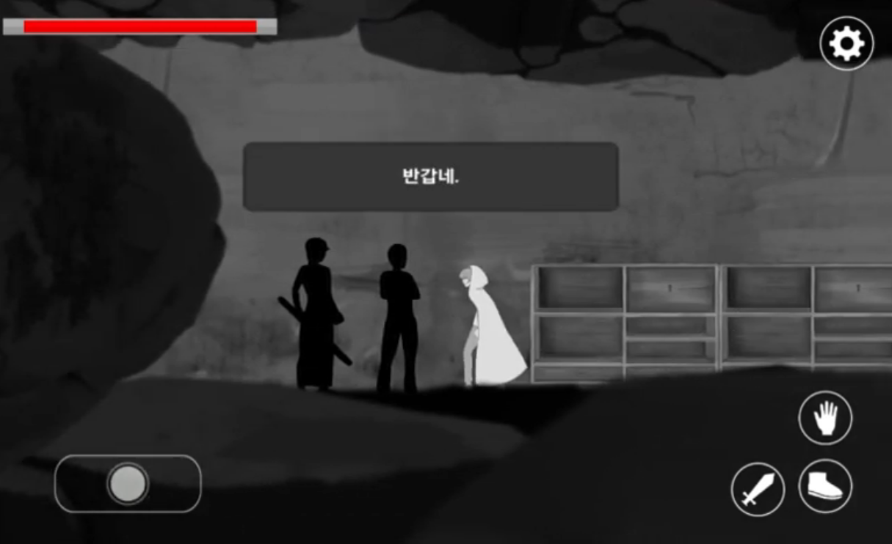 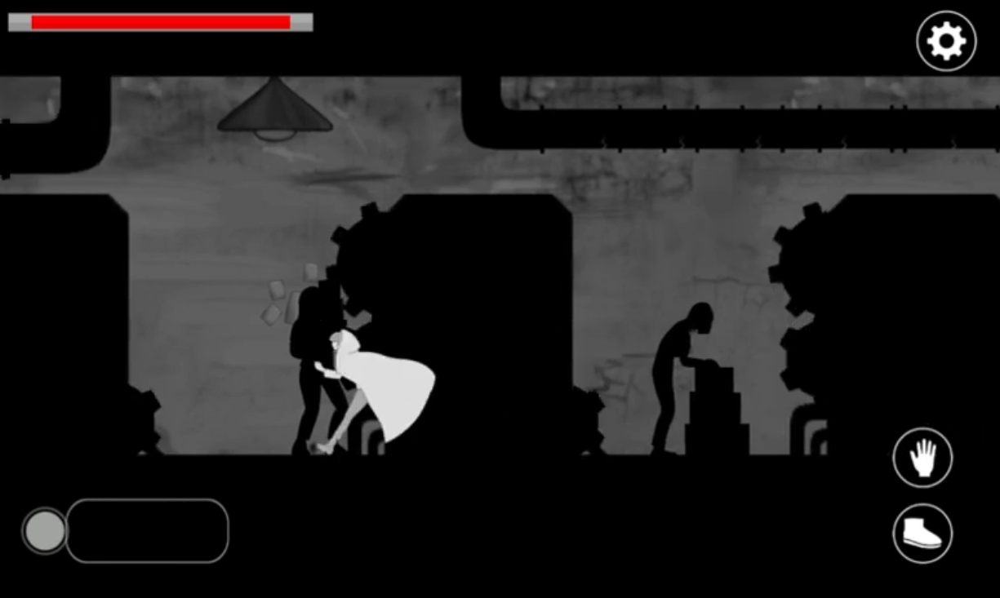 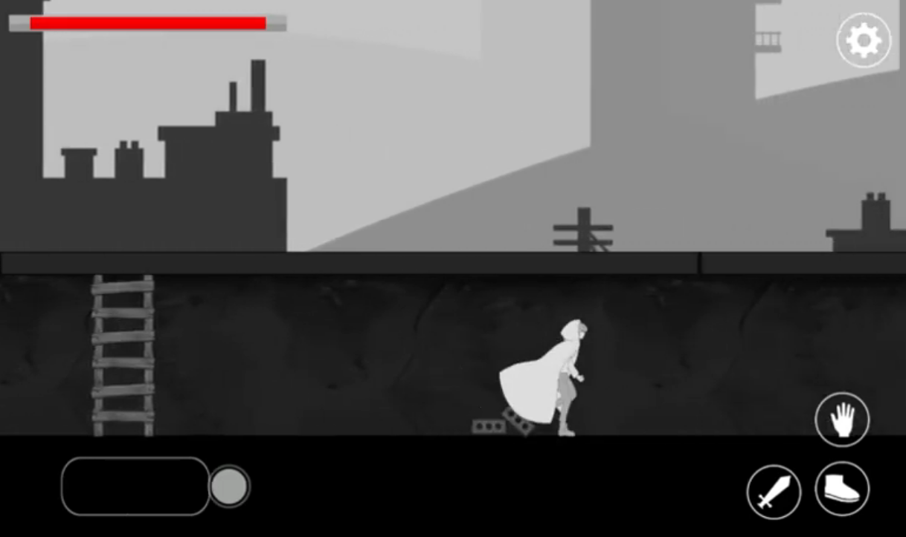
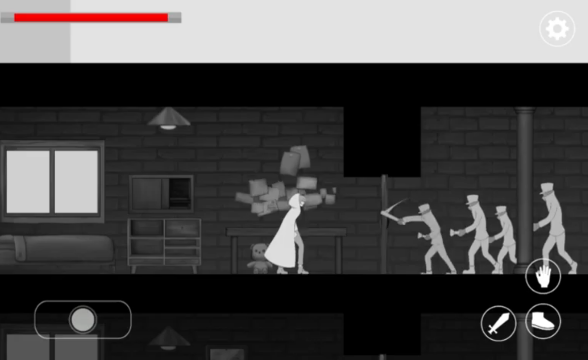 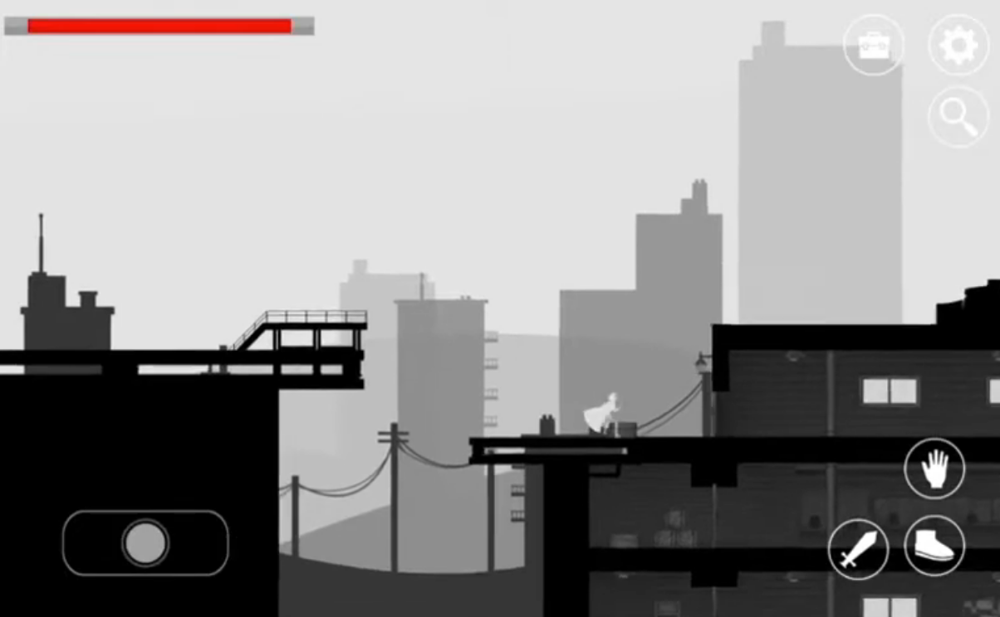 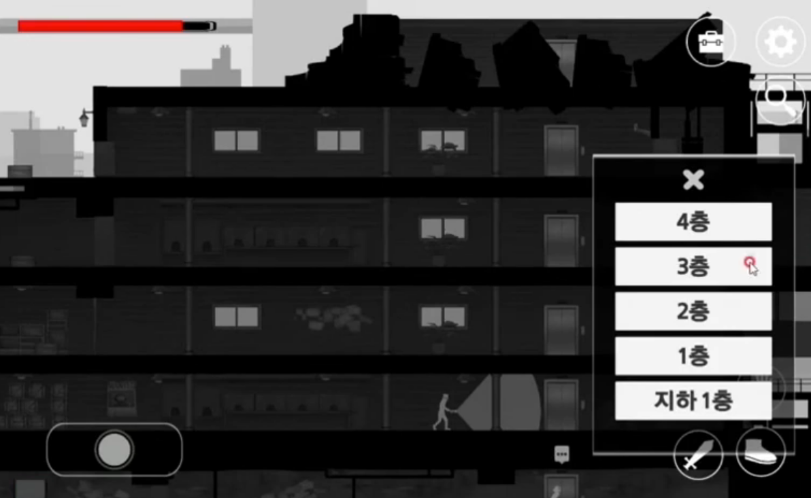
